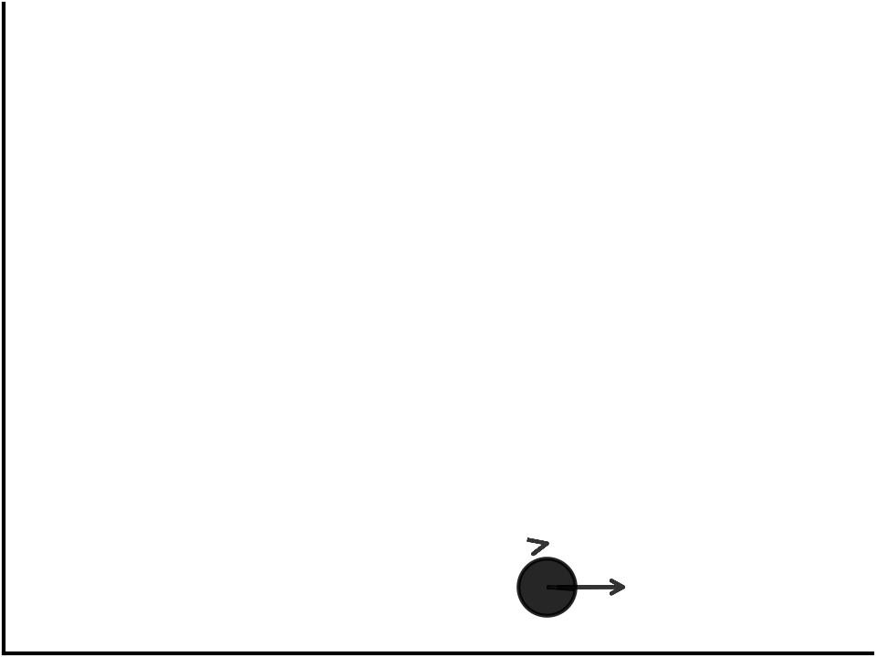

<h3>👨‍💻 Hi! I'm Minho.</h3>

 
 

  I am currently a Master's student at the <a href="http://www.ufc.br/">Federal University of Ceará</a> (UFC), in Brazil.  
  My research interests focus on the fields of <b><a href="https://en.wikipedia.org/wiki/Optimal_control">Optimal Control Theory</a></b> and <b><a href="https://en.wikipedia.org/wiki/Machine_learning">Statistical Machine Learning</a></b>, with applications on the optimal control, identification, and estimation of large-scale systems.

---
